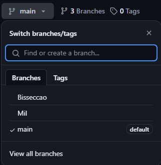

# Cálculos em Python

Repositório dedicado ao envio de trabalhos referêntes ao 6º período do curso de Engenharia de Software na UniGuairacá afim de obter nota parcial na matéria Cálculo e Cálculo Numérico.

Acesse as branchs para descobrir os conteúdos. ↓

